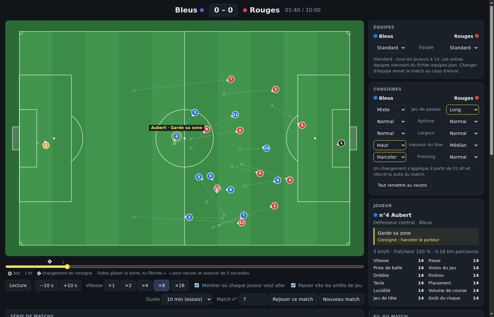

# foot-match-engine

Un moteur de match de football centré sur la tactique.

Le but : un jeu d'entraîneur où l'on gagne par ses choix tactiques. Pas de simulation du monde du foot ni du temps qui passe, seulement le match. Chaque footballeur réfléchit par lui-même, et l'on peut lire à tout moment ce qu'il fait et pourquoi.



## Regarder un match

Ouvrez `equipe.html` dans un navigateur (un double-clic suffit). Il n'y a rien à installer : le fichier contient tout.

1. **Choisissez votre équipe** (un club de Ligue 1 ou une équipe achetée avec un budget), sa formation, son placement et ses consignes, puis l'adversaire, et cliquez sur « Passer au match ». (« Match rapide », ou `match.html` ouvert seul : deux équipes standard.) Dans la page de match, on règle les consignes des deux camps, à droite ; on ne change pas d'équipe.
2. **Cliquez sur « Lancer le match ».** Le match entier est calculé en une seconde ou deux, puis il se lit comme une vidéo.
3. **Naviguez dans le match** avec la barre de temps, en avant comme en arrière. Les repères sur la barre sont les buts, les tirs et les changements de consigne.
4. **Changez une consigne en cours de match** : le passé ne bouge pas, toute la suite est recalculée.

Aussi dans la page :

- un clic sur un joueur montre ce qu'il est en train de faire, s'il suit une consigne, sa fraîcheur et ses notes ;
- une case affiche l'endroit où chaque joueur veut aller ;
- « Série de matchs » simule beaucoup de matchs avec les mêmes réglages et donne les moyennes des deux équipes. C'est le seul moyen honnête de juger une consigne : un match isolé ne prouve rien.

Le numéro de match fixe le hasard : même numéro, mêmes équipes et mêmes consignes redonnent exactement le même match.

## Les consignes

Chaque équipe a six consignes à trois positions. Une consigne est une **intention**, pas une règle : une équipe qui « joue court » tente encore un long ballon quand c'est nettement la meilleure solution.

| Consigne | Positions |
|---|---|
| Jeu de passes | Court · Mixte · Long |
| Rythme | Posé · Normal · Rapide |
| Largeur | Resserré · Normal · Large |
| Hauteur du bloc | Bas · Médian · Haut |
| Pressing | Attendre · Normal · Harceler |

## Les équipes

- **Standard** : tous les joueurs ont 14 sur 20 partout. Deux équipes strictement égales, pour que seules les consignes fassent la différence.
- **Élite, Élevé, Moyen, Faible** : quatre équipes de niveaux différents, avec des notes selon le poste. Elles sont dans `equipes.json`.
- **Les dix premiers de Ligue 1 2025-26** (Paris SG, Lens, Lille, Lyon, Marseille, Rennes, Monaco, Strasbourg, Toulouse, Lorient) : onze titulaires et des remplaçants par club, avec les notes du jeu EA Sports FC 27 converties sur 20 (`node tools/ligue1.js`). On les choisit dans `equipe.html` (« Prendre une équipe de Ligue 1 », ou comme adversaire).

`equipes.json` se modifie à la main : une ligne par joueur, vingt notes de 1 à 20. Après une modification, `node build.js` refait `match.html`.

## Travailler sur le moteur

Il faut [Node.js](https://nodejs.org) (testé avec la version 26). Le moteur lui-même n'a aucune dépendance.

```
node build.js                   # refait match.html après une modification
node check.js 200               # vérifie que le moteur ne déraille pas
node sim.js 60 1 5400           # 60 matchs de 90 minutes : moyennes comparées au vrai football
node tools/levels.js 60         # tournoi entre les quatre équipes de niveau (ou : node tools/levels.js 20 ligue1)
node tools/tactics.js 60 5400   # effet de chaque consigne, une par une
```

Comparer deux réglages, équipe et consignes :

```
node sim.js 100 1 5400 equipe=elite equipe=faible,line=-1,press=-1
```

Ici l'équipe élite joue contre l'équipe faible, qui défend bas (`line=-1`) et attend (`press=-1`). Les consignes s'écrivent `passing`, `tempo`, `width`, `line` et `press`, avec la valeur -1, 0 ou 1.

Les tests de la page demandent une installation, une seule fois : `cd tools && npm install`. Ensuite `node tools/page.js` vérifie la page dans un faux navigateur, et `node tools/browser.js` dans un vrai (Brave).

## Les fichiers

| Fichier | Rôle |
|---|---|
| `match.html` | La page complète, à ouvrir pour regarder un match. Fabriquée par `build.js`. |
| `engine.js` | Le moteur : joueurs, ballon, règles, décisions, consignes. Aucun affichage. |
| `render.js` | Le dessin du terrain. |
| `stats.js` | Les statistiques d'un match ou d'une série. |
| `index.html` | La page, avant assemblage. |
| `equipes.json` | Les quatre équipes de niveaux différents et les dix clubs de Ligue 1. |
| `sim.js`, `check.js`, `tools/` | Simulations, vérifications et outils de mesure. |
| `CLAUDE.md` | Le carnet du projet : fonctionnement du moteur, mesures, journal des essais, défauts connus. |

## Où en est le projet

C'est un travail en cours.

Ce qui marche :

- un match de 90 minutes entre deux équipes en 4-4-2, calculé en une seconde et demie ;
- entre deux équipes standard, les buts et les tirs sont proches du vrai football (3,2 buts par match, 15 % de buts sur les tirs dans la surface) ;
- les six consignes changent le jeu de façon mesurable ;
- prise de balle qui peut rater sous pression, fatigue, coups francs avec mur.

Ce qui ne va pas encore :

- **l'écart de niveau pèse beaucoup trop** : l'équipe élite bat l'équipe faible 8 à 0 en moyenne ;
- **la possession est à l'envers** : la meilleure équipe a moins le ballon que la plus faible ;
- le ballon sort trop rarement (trop peu de touches et de corners), donc il y a trop de passes ;
- certaines consignes sont mal équilibrées (le jeu long et le rythme rapide sont perdants contre une équipe neutre).

Le détail des mesures, des essais ratés et des défauts est dans `CLAUDE.md`.

Ce qui n'existe pas : d'autres formations que le 4-4-2, les remplacements, les cartons, la mi-temps, les consignes par joueur.
